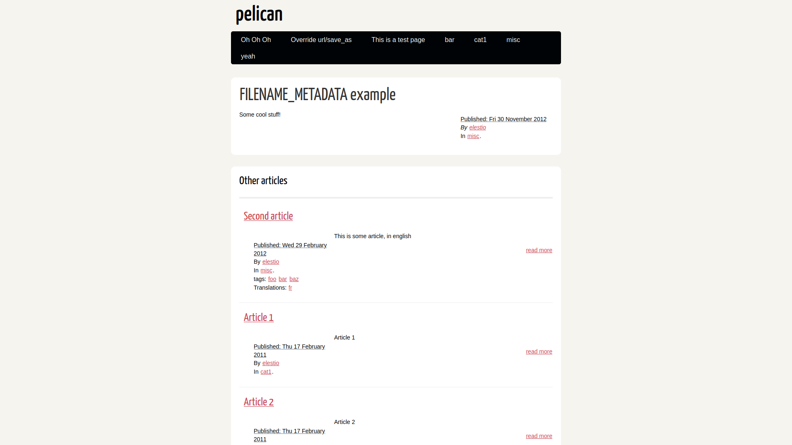

# Pelican Static Generator on Elestio

This is a minimal example of a Pelican static site created using pelican-quickstart

Click on the button below to deploy this repository with CI/CD on Elestio:

<a href="https://dash.elest.io/deploy?source=cicd&social=Github&url=https://github.com/elestio-examples/pelican"></a>



# Steps to clone this repository and run locally


### Step 1: Clone this repository

```
git clone YOUR_REPOSITORY_URL
```
### Step 2: Go to project folder

```
cd pelican
```

### Step 3: Install dependencies

```
pip install -r requirements.txt
```

### Step 4: Run your app in dev mode

```
pelican --autoreload --listen
```

### Step 5: Make some changes and push
Try to make some change in your Pelican project then push to the git repository

After few seconds to few minutes your change will be deployed on your CI/CD target 🚀
